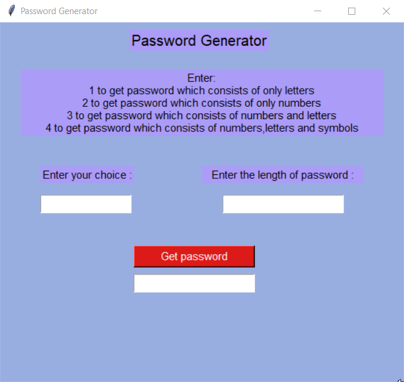

# 🔐 Password Generator (Tkinter)


This was one of my first desktop GUI apps — a simple password generator built using **Python 3.6** and **Tkinter**

The app generates secure passwords based on user preferences:
- Only letters (uppercase + lowercase)
- Only numbers
- Letters + numbers
- Letters + numbers + symbols

> ⚠️ This project is not actively maintained. It's part of my early journey as a developer and is kept for nostalgia and reference.

---

## 📸 Demo

  

---

## 🧠 Features

- GUI built with Tkinter
- 4 password generation modes
- Customizable password length
- Instant password display on screen

---

## 🚀 How to Run

### Requirements
- Python 3.6+
- Tkinter (comes pre-installed with Python)

### Run the App
```bash
python passwordgenerator.py
